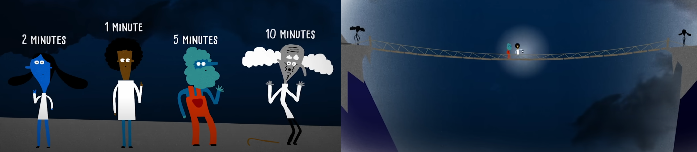

# The Bridge and Lantern Riddle

This project focus on solving 'The Bridge and Lantern Riddle', while leveraging the use of Cyber-Physical concepts and monads (monads of duration and non-determinism). The programming language of choice was Haskell.

## The Riddle

In the middle of the night, four adventurers encounter a shabby rope bridge spanning a deep ravine. For safety reasons, they decide that no more than two people should cross the bridge at the same time and that a flashlight must be carried by one of them during every crossing. They have only one flashlight.

The four adventurers have different crossing speeds: it takes them **1, 2, 5, and 10 minutes**, respectively, to cross the bridge alone. When two adventurers cross together, they take as long as the slower of the two.

One of the adventurers claims that they cannot all reach the other side in less than **19 minutes**. However, another disagrees, arguing that it is possible in just **17 minutes**.

## Objectives

1. Model the system using what you have learned about monads, particularly the duration and non-deterministic ones.
2. Demonstrate that all adventurers can indeed reach the other side in **17 minutes**.
3. Prove that it is impossible to cross in less than **17 minutes**.

**Project Stack:** Haskell, monads, cyber-physics and maths.
